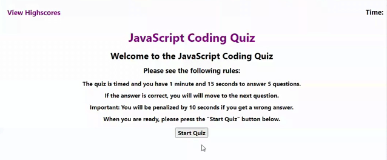
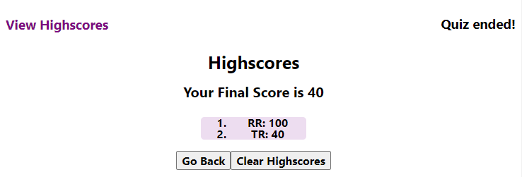
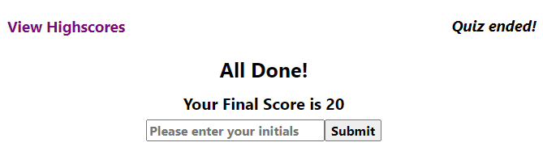

# code_quiz

This application presents a JavaScript Code quiz. There are 5 questions and the quiz is timed.

## Objectives
1. Create a timed code quiz
2. Start button to initiate the quiz
3. If the user gets a correct answer than a correct message is displayed and another question is presented
4. If the user gets an incorrect answer than "wrong" message is displayed and penalized in 10 seconds.
5. Game is over once all the questions are answered or the timer reaches 0.
6. Name and Score can be saved to a highScore board.

## JavaScript 

### Object and Variables
 - A question's object was created to store each question with their own alternatives and correct answer.
This way it's more organized and can be easily reached for changes and adjustments.

- Variables were created to link all the javaScript info to the html and to be used inside the functions, such as: secondsLeft, qCounter, totalScore and highScoreArray.


### Event Listener

- Start Button - once it's clicked the countdown time starts and the questions are displayed:



- Alternatives - once the user click in one of the 4 alternatives, than a correct or incorrect message will be displayed. In order to get the user's click, it was used the target event:

````js
var userClick = event.target;
````
- View HighScores - HighScores board is displayed

- "Go Back" button - returns to the Quiz instructions and the user can start the quiz again.

- "Clear HighScore" button - clears the local storage and all the users name and scores are cleared from the HighScore's board.




### Functions -

1. Display Question - questions will be displayed until the user gets to the last one or when the time ends.

2. Function Quiz End: When the quiz is done, than the user is able to see the final Score and input initials or name so the info can be saved:



3. Function Save Score - saves the user initials and score to the local storage.

4. Function Init - get's the saved score from the local storage.

5. Function Display Score - displays the user's score on the Score Board


## Link to application available at:

https://renatatims.github.io/code_quiz/


